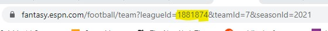
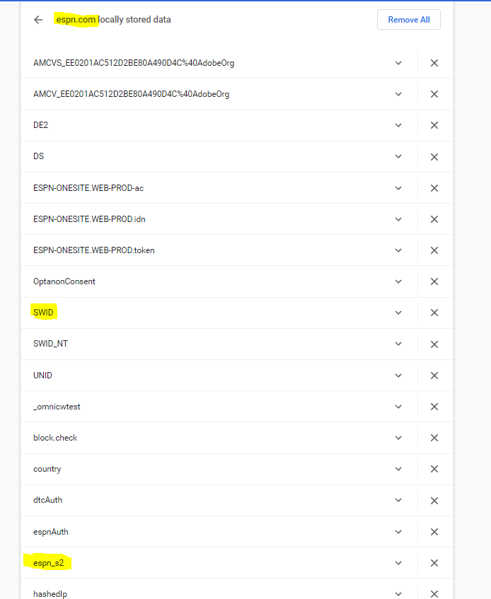

**Note: As of now, this application only works for public and private ESPN leagues. I may plan to add additional functionality later.**

# Gathering Application Inputs

To run this application, you need to gather some information about your league to use as inputs. 

## Public Leagues

For people playing in Public Leagues, you will simply need to find out your **League ID**. This is simple, as it can usually be found in the url of any page on the ESPN Fantasy Football website. See below for an example:

&nbsp;
## Private Leagues

For Private Leagues, you will need to gather some additional information in addition to the League ID. These two other pieces of information are cookies, which can be accessed on Google Chrome by navigating to Settings -> Privacy and security -> Cookies and other site data -> See all cookies and site data -> Search "espn" in the cookies -> Navigate to the espn.com cookie list. 

Once you do this, you will need to gather the values of two cookies: **SWID** and **espn_s2**. The **SWID** token should be a series of numbers and letters surrounded by curley braces ("{ }"}). The **espn_s2** token should be a very long string that includes the percentage symbol ("%") repeatedly in the string. See below:

